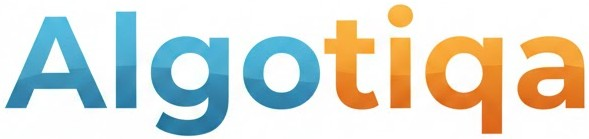

## Introduction

**Algotiqa** is a platform specifically designed for algorithmic trading. The idea is to design a platform that helps
algo traders to:

- Write trading systems, using a simple IDE and leveraging a programming language specifically designed for trading
- Run them in a sandbox, taking data from a data provider and executing trades in a broker
- Monitor all activities, alerting traders when new issues arises
- Manage the portfolio, automatically selecting which systems should be activated and which ones should be deactivated

What you won't find here:
- All tools needed for a discretionary trader (like technical analysis, sketching on charts)

Even though the platform is designed to be generic, we will initially focus on **Futures trading**. Demand for other instrument types (*options*, *stocks*, *forex*, *crypto*) will be addressed later, when the platform will be mature and stable enough on Futures.

## Goals

Simply stated, the **Algotiqa** platform will try to address all pain points of current systems. Specifically:

- No need to manually rollover any contract. The platform will automatically roll contracts a few days before expiration
- No need for continuous contracts or custom futures. The platform will automatically build continuous contracts on the fly
- As a consequence of the previous bullet, no need to reload continuous contracts at every rollover
- Money (costs, point value) at broker level. This allows traders to use data from big contracts (like ES, NQ, CL, GC,
  ...) when trading micro instruments (like MES, MNQ, MCL, MGC, ...)
- No need to turn on/off trading systems. This can be done automatically specifying filters
- Robustness: a trading system's position must never go out of sync with the associate position in the broker
- The lack of easy programming languages specifically designed for trading
- Missing of deep monitoring tools and alerting systems
- Missing of a development environment focused at crafting trading systems

## Documentation

[Architecture](architecture/index.md)

[Core concepts](concepts/index.md)

[Administration](admin/index.md)

[User guide](user/index.md)

[Tiq engine](tiq/tiq.adoc)

## License

In the spirit of open source software, all platform components will be free under the **Elastic License 2.0 (ELv2)**. We believe in the community and in collaboration, without which a platform like this won't be possible. 

* **For individuals and traders:** Usage is completely free for both personal and commercial purposes (including trading for personal profit).
* **For companies and competitors:** Offering this platform as a managed service (SaaS) or as a Cloud service to third parties is strictly prohibited.

For further details, please consult the [LICENSE](https://github.com/algotiqa/docs/blob/main/LICENSE.md) file in this repository.

## Contributing

For contributing guidelines, see [CONTRIBUTING](https://github.com/algotiqa/docs/blob/main/CONTRIBUTING.md)
