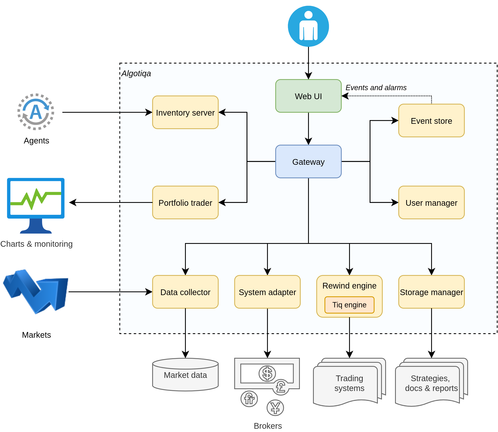
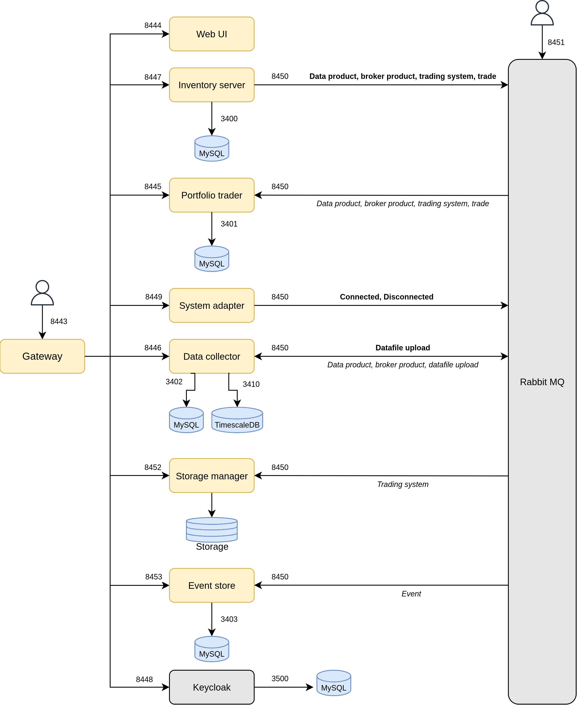
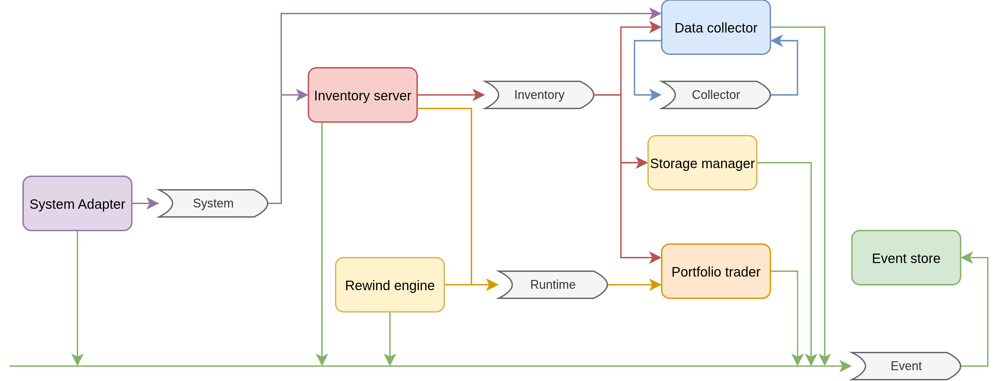
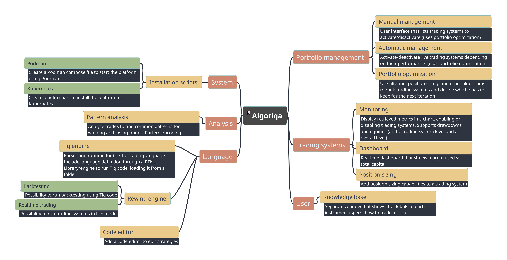

# Architecture

## Introduction

The platform is designed as a set of microservices and engines:

| Component             | Notes                                                                                          |
|-----------------------|------------------------------------------------------------------------------------------------|
| Gateway               | Common entrypoint for the platform that dispatches requests to all other components            |
| Web user interface    | Graphical interface of the platform                                                            |
| Inventory Server      | Manages the inventory: trading systems, sessions, instruments, connections, etc... |
| Portfolio Trader      | Takes care of trading system executions, portfolios, metrics collection and money management in general    |
| Data Collector        | Stores instrument data into a local database (Timescale DB). Provide data to all other components  |
| System Adapter        | Connects Algotiqa to external data providers and brokers       |
| Rewind engine      | This is the trading runtime: takes prices from the data collector and sends buy/sell orders to adapters. Uses the Tiq engine to run trading systems           |
| Storage manager| Manages all file related contents associated to a trading system (Tiq code, documentation, etc...)             |

There is also a small set of other minor components. As the development of the platform requires ages, some components have been developed to take advantage of other existing products (like Multicharts).

| Component               | Notes                                                                               |
|-------------------------|-------------------------------------------------------------------------------------|
| Strategy Fetcher        | Component to read exported metrics generated above and export them as REST services |
| Strategy metrics export | Multicharts function in PowerLanguage to export daily profits in semi-CSV format    |

## Design

## Queue subsystem

## Roadmap

A (possible) roadmap is depicted belo:

