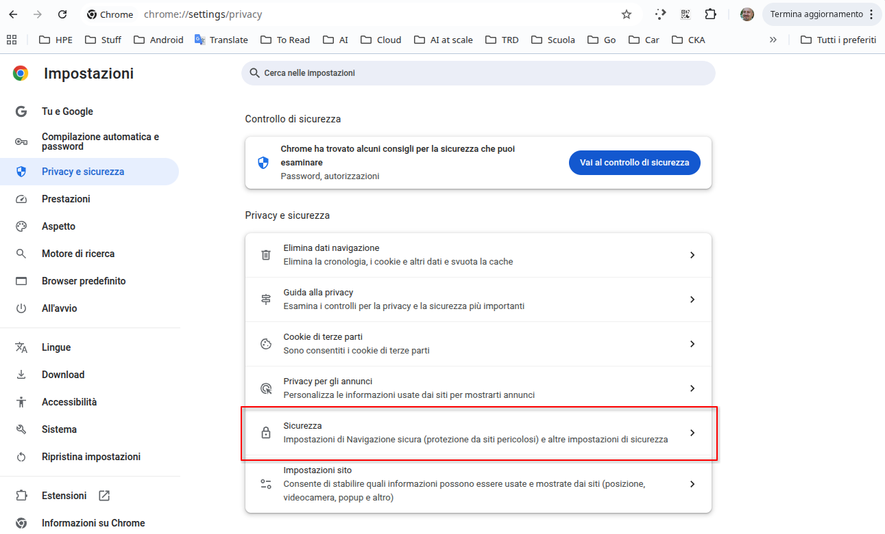
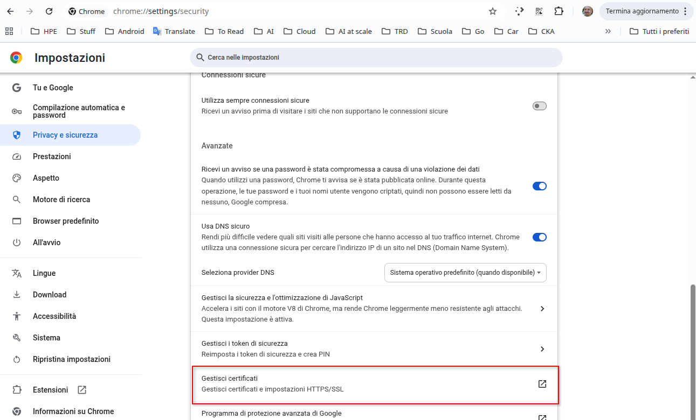
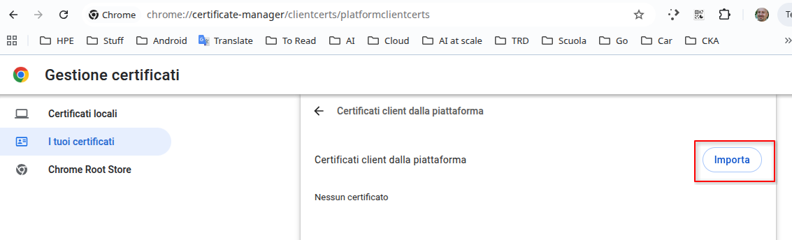
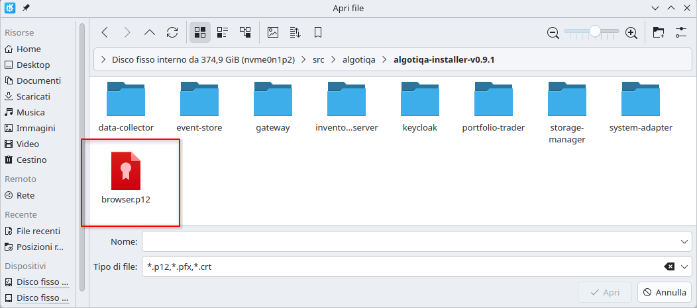
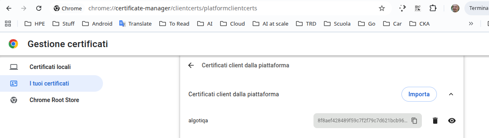

== Local installation

=== Prerequisites

To run the platform, either `docker` or `podman` needs to be locally installed together with its `compose` package.

In terms of disk space, make sure to have at least *10GB* of free space for the container images and market data.

=== Downloading the installer

The installer can be downloaded from `https://github.com/algotiqa/install/releases/` . It is very small and after downloading simply unzip it into any folder. Make sure that the disk you select has enough free space.

=== Starting the platform

If you are using the command line interface, open a terminal inside the unzipped folder and issue:

----
docker compose up -d
# or
podman compose up -d
----

The first boot can take a few minutes as it:

- downloads the containers
- creates and fills the databases (migration containers)
- imports the Keycloak realm

=== Accessing the user interface

The current platform version requires a client certificate (the `browser.p12` file) to be installed into the browser. Follow the instructions below for your browser.

==== Importing the certificate in Chrome

On Chrome, open the *Settings* page and, on the left menu, select *Privacy and security*. Then, in the middle panel select *Security*, as shown in the image below:

Now, scroll down to find the *Certificate management* option:

Click that option. In the new page, select *My certificates* on the left menu. You should see a panel like the one below:

Click the *Import* button and locate, inside the folder where you unpacked the installer, the *browser.p12* file:

After clicking that file, a dialog will appear asking for the certificate's password: just click the `ok` button (there is no password). If the import operation completes with success, you should see a page similar to the following one:

==== Opening the platform's page

Pointing your browser at `https://algotiqa:8443/`, you should see the login page

- Keycloak admin console: `https://algotiqa:8443/auth/admin/` (default admin credentials `admin` / `admin`).

=== Stopping the platform

To stop the platform, simply issue:

----
docker compose down
----

=== Configuration

All components are deployed with default credentials `admin`/`admin`.

Environment variables override the YAML files using the `ALGO_` prefix (dots become underscores).

`.env` holds the values, but `compose.yaml` does **not** pass any
`env_file`/`environment:`/`${...}` substitution to the service containers, so
the values never reach the running services — the YAML files ship literal
`PUT_YOUR_KEY_HERE` placeholders. To actually activate a secret, uncomment/add
an `environment:` entry for the corresponding service.

| `.env` key | Config key | Service | Current value |
| --- | --- | --- | --- |
| `NAME` | container name prefix (`${NAME}-*`) | all | `algotiqa` |
| `ALGO_AUTHENTICATION_CLIENTSECRET` | `authentication.clientSecret` | data-collector, portfolio-trader | `PUT_YOUR_KEY_HERE` in YAML |
| `ALGO_PROVIDER_CURRENCY_APIKEY` | `provider.currency.apiKey` | inventory-server | `PUT_YOUR_KEY_HERE` in YAML |

keycloak secrets
